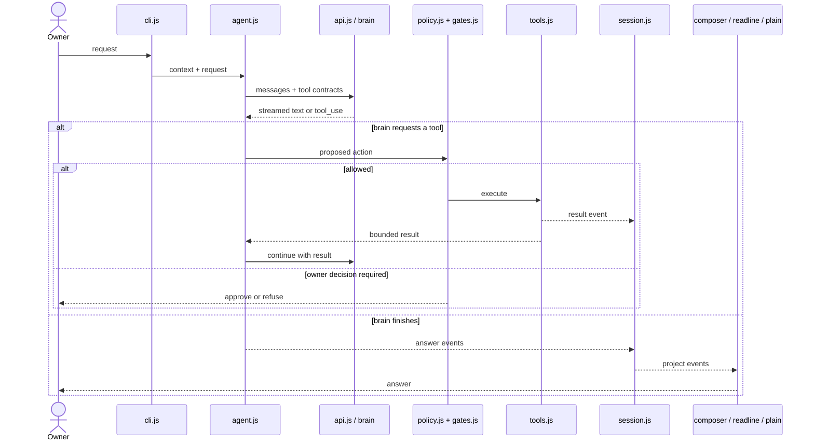
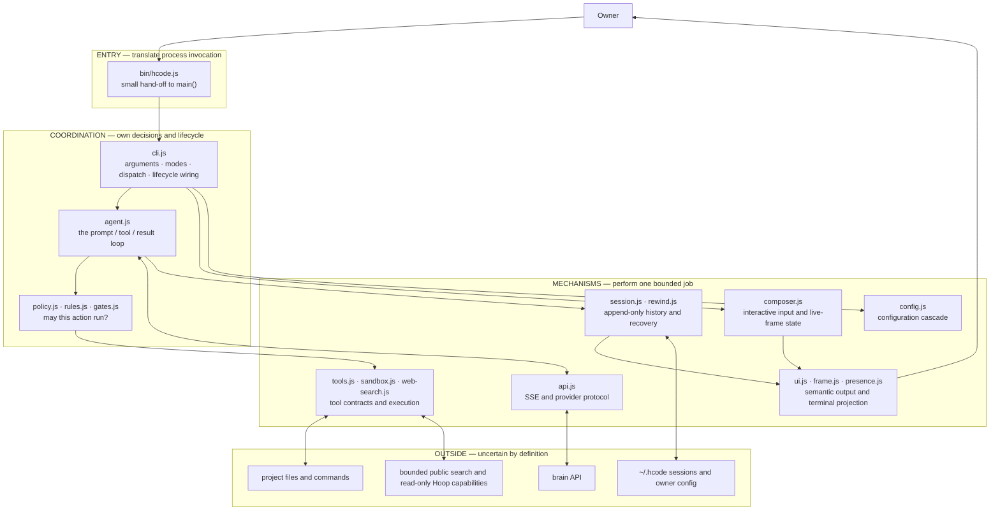
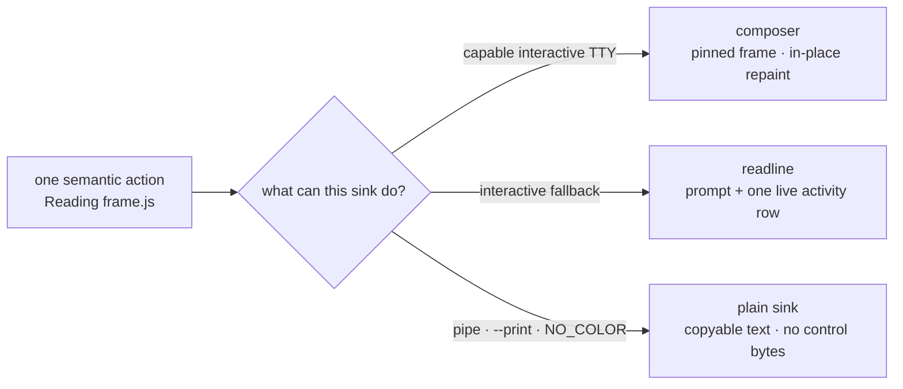

# hcode architecture map

Read this in ten minutes before changing hcode. The durable idea is small:

> read the owner's request → ask the brain → gate proposed tools → execute → append events → ask again → render the answer

Everything in hcode exists to make one part of that loop correct when the terminal is narrow, a stream is
interrupted, several tools arrive together, a process crashes, or output is going to a pipe instead of a person.

Snapshot, measured 2026-09-01: 50 JavaScript files and 11,868 lines in `src/`; 49 JavaScript test files and
8,158 lines in `test/`. These numbers are orientation, not an invariant.

## 1. The loop

The return from a tool result to the brain is the agent loop. A thirty-second turn is usually several trips
around it, not one long function call. `session.js` records the durable events along the way, which is why a
thread can resume without pretending an interrupted side effect completed.

## 2. Responsibility zones

This is a responsibility map, not a literal list of every ES import. A healthy change moves through the map
in this direction: coordination chooses; mechanisms perform; external systems remain untrusted.

“Abstraction” here means a stable translator between two sides. `agent.js`, for example, can report a semantic
action such as “read this file” without knowing terminal width, colour support, or whether stdout is a pipe.
The UI boundary translates that meaning into the right bytes. The same principle appears at the policy boundary
(intent → decision), tool boundary (validated request → effect), and session boundary (runtime event → durable log).

## 3. The three render paths

One semantic state has three correct projections because hcode does not always speak to the same kind of sink.

The paths should not look identical. They must preserve the same meaning.

- `createUI()` in `src/ui.js` owns the semantic tool-action table.
- `src/composer.js` owns full-screen geometry and the bottom-pinned frame.
- The readline fallback may repaint its one activity line.
- Plain output contains no ANSI, carriage return, cursor movement, or colour-only meaning.

This used to be a memory rule after a fix reached readline but not the owner's composer. It is now executable:

- `test/ui.test.js` table-drives the same tool semantics through composer, readline, and plain output.
- `test/render-property.test.js` runs seeded operations in a real tmux pseudo-terminal, compares the live screen
  with a fresh repaint of the same state, and rejects a fourth cursor/scroll painter.
- `test/frame.test.js` and `test/composer.test.js` are the faster geometry and input gates.

For wording or colour, run the nearest semantic tests. Run the seeded PTY gate when rows, wrapping, cursor
placement, scroll regions, input protocols, or resize behaviour change.

## 4. Why `cli.js` is expensive to touch

At the 2026-09-01 snapshot, `src/cli.js` is 1,356 lines and has 40 direct local imports (45 imports including
Node built-ins). It is the switchboard for interactive mode, one-shot tasks, `--print`, resume, connections,
diagnostics, sessions, slash commands, render-path selection, cancellation, and process cleanup.

Two different costs matter:

- **Fan-out:** how many modules a file must understand. High fan-out makes a file expensive to read and reason about.
- **Fan-in:** how many callers depend on a module. High fan-in makes a module risky to change.

`cli.js` has unusually high fan-out and sits on every invocation path. Do not combine a feature change with a
broad `cli.js` refactor. First pin the behaviour with a focused test; then extract one cohesive responsibility
in a separate change. `ui.js`, `config.js`, and session primitives have the opposite kind of risk: they are easy
to call from many places, so a small semantic change can affect many consumers.

## 5. Where to make a change

| Change | Start here | Prove it with |
| --- | --- | --- |
| Brain stream or continuation | `agent.js`, `api.js` | agent/API tests, interrupted and failure paths |
| New or changed tool | `tools.js`, then `policy.js` / `gates.js` / `sandbox.js` | contract, allow, ask, deny, and failure tests |
| Status wording or output meaning | `ui.js`, `presence.js`, `commands.js` | `ui.test.js`; plain-output assertion |
| Input, layout, resize, live frame | `composer.js`, `frame.js`, `input-state.js` | composer/frame tests; PTY property gate if geometry changes |
| Resume, recovery, rewind | `session.js`, `rewind.js` | crash/replay and reference-lifetime tests |
| CLI command or mode | the owning small module, then `cli.js` wiring | command-specific test plus the affected render paths |
| Configuration | `config.js` | precedence: CLI > environment > owner config > default |
| Public web search | `web-search.js`, `tools.js` | fixed provider, redirect, size, timeout, and source-label tests |
| Connected Hoop | `connect.js`, `brain.js`, `connectors.js` | read-only capability and tunnel-cleanup tests |

## 6. Fast reading route

1. Read `README.md` for the product contract and `HCODE.md` for contributor rules.
2. Read this file through the render-path section.
3. Open only the row in the table above that matches your change.
4. Read `CAPABILITY-BOUNDARY.md` before changing tools, delegation, network, or permissions.
5. Read `memory/MEMORY.md`, then only the one memory entry relevant to the change.
6. Read the nearest test before editing; it is usually a more current contract than prose.

Close a change with the smallest relevant test first, then `npm run check` and `npm test`. Keep architecture
facts here: if a module boundary, event flow, trust boundary, or render path changes, update this map in the same
commit. Process history belongs in the changelog or a task ledger, not in the architecture.
