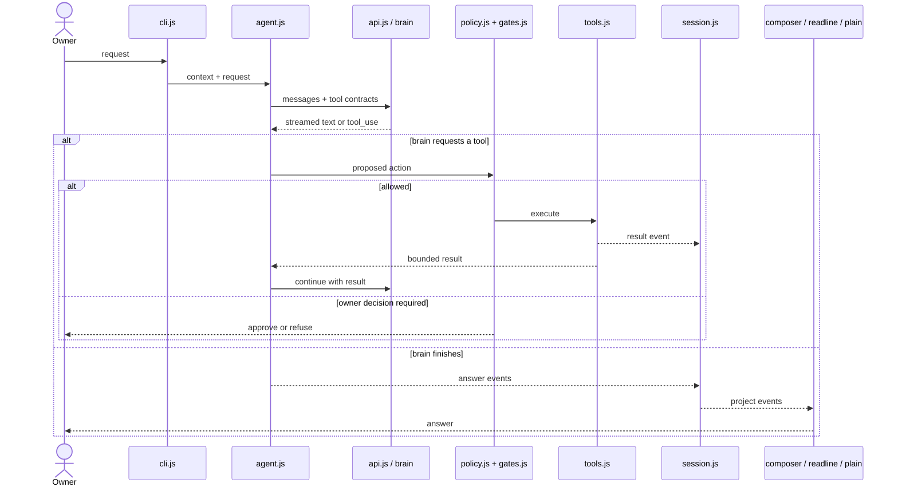
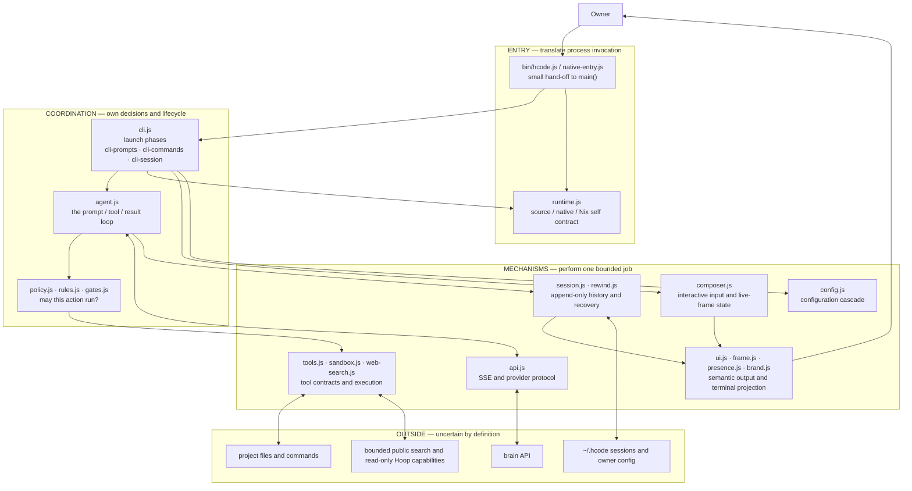
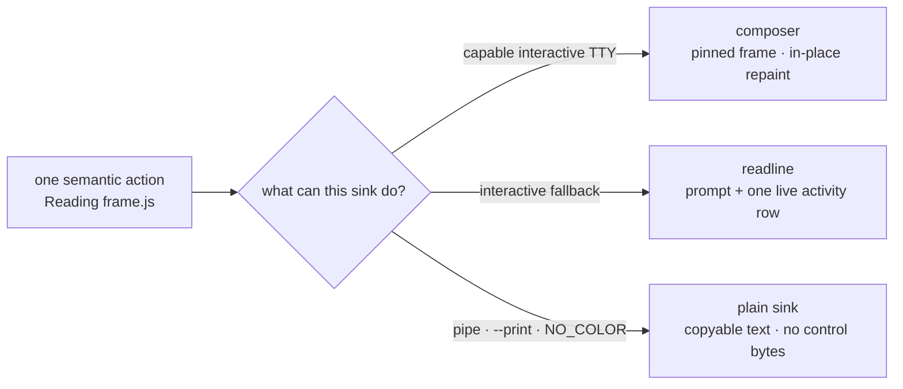
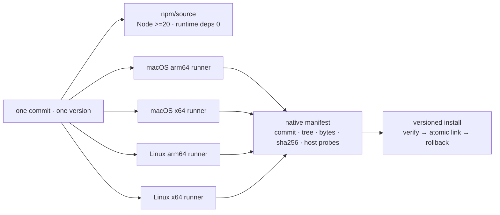

# hcode architecture map

Read this in ten minutes before changing hcode. The durable idea is small:

> read the owner's request → ask the brain → gate proposed tools → execute → append events → ask again → render the answer

Everything in hcode exists to make one part of that loop correct when the terminal is narrow, a stream is
interrupted, several tools arrive together, a process crashes, or output is going to a pipe instead of a person.

Snapshot, measured 2026-09-02: 58 JavaScript files and 12,903 lines in `src/`; 59 JavaScript test files and
9,021 lines in `test/`. These numbers are orientation, not an invariant.

## 1. The loop

The return from a tool result to the brain is the agent loop. A thirty-second turn is usually several trips
around it, not one long function call. `session.js` records the durable events along the way, which is why a
thread can resume without pretending an interrupted side effect completed.

In `agent.js` each arrow above is a named phase, and `runAgent()` only sequences them: `callBrain()` streams one
model call with its own retries and fallbacks, `recordProposal()` writes the proposed tool calls down with
hcode's own stable ids, `prepareCall()` states what a call is, `shortCircuit()` answers the calls that need
neither a decision nor a run (malformed, replayed, refused hesitation), `negotiate()` is the broker, `runTool()`
executes and classifies, and `settleCall()` tells the ledger and the screen. Reading those seven names in order
is the loop; the invariant they encode is that brains propose, policy decides, tools act, the session records,
and the terminal projects.

When one step proposes several tools, judging them stays strictly serial — an owner is never asked two questions
at once — and only the waiting overlaps: a contiguous run of calls that are idempotent, purely `read` risk, valid,
not a replay and allowed without asking runs up to four at a time. Writes, `bash`, network, `ask_user` and
delegation stay one after another, results return to the brain in the model's order, and the ledger and all three
render paths are written after the batch settles, again in that order. The live activity row holds one line, so a
batch announces itself once — the first call's own words plus how many wait beside it — instead of each start
painting over the last and leaving the owner told about one call in four. The overlap is real rather than nominal
because `read_file`, `list_dir`, `glob` and `grep` wait on the filesystem asynchronously, while every path they
touch is still judged synchronously before the first await — the boundary is decided in full before a byte is
asked for. `HCODE_PARALLEL_TOOLS=0` or `"parallelTools": false` in project settings restores the fully serial loop.

## 2. Responsibility zones

This is a responsibility map, not a literal list of every ES import. A healthy change moves through the map
in this direction: coordination chooses; mechanisms perform; external systems remain untrusted.

“Abstraction” here means a stable translator between two sides. `agent.js`, for example, can report a semantic
action such as “read this file” without knowing terminal width, colour support, or whether stdout is a pipe.
The UI boundary translates that meaning into the right bytes. The same principle appears at the policy boundary
(intent → decision), tool boundary (validated request → effect), and session boundary (runtime event → durable log).

## 3. The three render paths

One semantic state has three correct projections because hcode does not always speak to the same kind of sink.

The paths should not look identical. They must preserve the same meaning.

- `createUI()` in `src/ui.js` owns the semantic tool-action table.
- `src/brand.js` owns the fixed-cell terminal translation of the canonical HoopGram SVG; `ui.js` alone decides
  whether it is the bounded launch splash, the static dialog mark, or absent from a plain sink.
- `src/composer.js` owns full-screen geometry and the bottom-pinned frame.
- The readline fallback may repaint its one activity line.
- Plain output contains no ANSI, carriage return, cursor movement, or colour-only meaning.

The launch splash runs before the composer owns the screen, clears its last frame, and never enters the session
transcript. It is skipped for pipes, print mode, CI, dumb/no-colour terminals and reduced motion. Once the composer
starts, only the compact static mark is transcript content; this keeps the no-fourth-render-path invariant intact.

This used to be a memory rule after a fix reached readline but not the owner's composer. It is now executable:

- `test/ui.test.js` table-drives the same tool semantics through composer, readline, and plain output.
- `test/render-property.test.js` runs seeded operations in a real tmux pseudo-terminal, compares the live screen
  with a fresh repaint of the same state, and rejects a fourth cursor/scroll painter.
- `test/frame.test.js` and `test/composer.test.js` are the faster geometry and input gates.

For wording or colour, run the nearest semantic tests. Run the seeded PTY gate when rows, wrapping, cursor
placement, scroll regions, input protocols, or resize behaviour change.

## 4. Why `cli.js` is expensive to touch

`src/cli.js` is the launch, and only the launch: read the arguments, settle the configuration and the agency
grant (`openLaunch`), let a one-shot subcommand answer (`answerOneShot`), attach a brain (`attachBrain`), then
hand the process to one interactive session (`runSession`). `main()` is that list, in that order, in 38 lines.

The three things it hands off to are their own modules:

- `cli-prompts.js` — how hcode asks a human something before a session exists: queued line input, the setup
  picker, the y/n/a decision gate, the brain chooser, the switch that applies a permission mode.
- `cli-commands.js` — the one-shot subcommands, as seven groups consulted in a fixed order. **That order is the
  command surface**: `hcode tools --resume list` prints sessions because history is answered before the catalog.
- `cli-session.js` — one interactive session as phases in the order they happen: open the thread → choose a
  render path → answer the startup permission → attach the channels that can ask the owner something → feed the
  loop. The phases share one named context object rather than a closure, because the values that move
  underneath them (the thread, its spend, its last prompt size, the running turn's AbortController) are exactly
  the ones a closure hides. The slash catalog is eight ordered groups; each answers `true` (leave), `false`
  (handled, stay) or `null` (not mine), and `null` is what lets the next group see the line.

`test/cli-phases.test.js` pins the two orders and the null contract; swapping two groups fails it.

Two different costs matter:

- **Fan-out:** how many modules a file must understand. High fan-out makes a file expensive to read and reason about.
- **Fan-in:** how many callers depend on a module. High fan-in makes a module risky to change.

The `cli-*` files still have unusually high fan-out between them and sit on every invocation path. Do not
combine a feature change with a broad `cli-*` refactor. First pin the behaviour with a focused test; then
extract one cohesive responsibility in a separate change. `ui.js`, `config.js`, and session primitives have the
opposite kind of risk: they are easy to call from many places, so a small semantic change can affect many
consumers.

## 5. Where to make a change

| Change | Start here | Prove it with |
| --- | --- | --- |
| Brain stream or continuation | `agent.js`, `api.js` | agent/API tests, interrupted and failure paths |
| New or changed tool | `tools.js`, then `policy.js` / `gates.js` / `sandbox.js` | contract, allow, ask, deny, and failure tests |
| Status wording or output meaning | `ui.js`, `presence.js`, `commands.js` | `ui.test.js`; plain-output assertion |
| Input, layout, resize, live frame | `composer.js`, `frame.js`, `input-state.js` | composer/frame tests; PTY property gate if geometry changes |
| Resume, recovery, rewind | `session.js`, `rewind.js` | crash/replay and reference-lifetime tests |
| CLI command or mode | the owning small module, then `cli-commands.js` (one-shot) or `cli-session.js` (slash) wiring | command-specific test plus the affected render paths |
| Configuration | `config.js` | precedence: CLI > environment > owner config > default |
| Native build, resource or self-relaunch | `runtime.js`, then the owning worker | source/native parity and real artifact probes |
| Install, update or rollback | `native-install.js`, `update.js` | wrong hash/platform, interrupted switch, rollback, source/Nix refusal |
| Public web search | `web-search.js`, `tools.js` | fixed provider, redirect, size, timeout, and source-label tests |
| Connected Hoop | `connect.js`, `brain.js`, `connectors.js` | read-only capability and tunnel-cleanup tests |

## 6. Fast reading route

1. Start with `DEVELOPING.md` for the public workflow, then use `README.md` for the product contract and
   `HCODE.md` for the instructions hcode loads into coding agents.
2. Read this file through the render-path section.
3. Open only the row in the table above that matches your change.
4. Read `CAPABILITY-BOUNDARY.md` before changing tools, delegation, network, or permissions.
5. Read `memory/MEMORY.md`, then only the one memory entry relevant to the change.
6. Read the nearest test before editing; it is usually a more current contract than prose.

Close a change with the smallest relevant test first, then `npm run check` and `npm test`. Keep architecture
facts here: if a module boundary, event flow, trust boundary, or render path changes, update this map in the same
commit. Process history belongs in the changelog or a task ledger, not in the architecture.

## 7. Distribution is a projection, not a fork

`runtime.js` is why this does not become five codebases: source mode relaunches `node bin/hcode.js`; a SEA
relaunches its own executable; Nix identifies itself as immutable. `native-install.js` owns only artifact
integrity and link switching. The agent, tools, policy, session and UI are shared byte-for-byte before bundling.

Release candidates use Node 24 LTS, an exact esbuild CommonJS bundle and the established SEA/postject injection
path. Each target remains `verified:false` until that exact file executes version, help and embedded-charter
probes on its own OS/architecture. The CI workflow can build candidates but has no release/publish job. npm,
GitHub Release, Developer ID signing/notarization and Nix publication remain separate evidence and owner gates.

## 8. File table

Every `bin/*.js`, `src/*.js`, and `scripts/*.mjs` file, one role per line, grouped by the zone it belongs to.
`test/doc-drift.test.js` fails if this table and the real file set diverge in either direction — update both in
the same commit.

### entry — translate process invocation

| File | Role |
| --- | --- |
| `bin/hcode.js` | CLI entrypoint; hands off to `main()` in `src/cli.js`. |
| `bin/hcode-supervise.js` | Supervisor alias entrypoint; runs the retry-circuit main. |
| `src/native-entry.js` | Node SEA main; also dispatches the hcode-supervise alias. |
| `src/runtime.js` | Detects source/native/Nix identity; owns self-relaunch and resource paths. |
| `src/cli.js` | Launch only: `main()` runs the setup phases in 38 lines. |
| `src/cli-prompts.js` | Owner-facing prompts before a session exists: setup picker, decision gate, brain chooser. |
| `src/cli-commands.js` | One-shot subcommands as seven ordered groups (`ONE_SHOT_GROUPS`). |
| `src/cli-session.js` | Interactive session: context object, render-path choice, slash groups (`SLASH_GROUPS`), event loop. |

### kernel — the agent loop and its objectives

| File | Role |
| --- | --- |
| `src/agent.js` | The agent loop: stream brain, negotiate tools, run, record. |
| `src/mission.js` | Durable objective runner; keeps the mission across turn checkpoints. |
| `src/coordinator.js` | Versioned coordinator contract with append-only decisions and objectives. |
| `src/work.js` | Opens and proposes coordinator work items for a project. |
| `src/session-tree.js` | Pure projection of owner-facing task/work facts from events. |
| `src/subagents.js` | Governs which brain a delegated subagent may run on. |
| `src/tasks.js` | Persistent background conversations with installed Claude Code/Codex CLIs. |

### brain — the provider and external runners

| File | Role |
| --- | --- |
| `src/api.js` | Anthropic Messages API client; streaming SSE with tool use. |
| `src/brain.js` | Read-only brain readiness detection and owner runner selection state. |
| `src/connect.js` | `hcode connect`: SSH tunnel to the owner's Hoop brain. |
| `src/runners.js` | Detects optional external Claude Code/Codex runner binaries on PATH. |
| `src/runner-bins.js` | Shared executable names and PATH probe used by runner detection and automatic selection. |
| `src/connectors.js` | Read-only MCP/connector discovery through owner-installed official CLIs. |
| `src/polyglot.js` | Runs the public polyglot coding benchmark across runners. |
| `src/benchmark.js` | Deterministic, offline-by-default public hcode benchmark harness. |

### tools & policy — may this action run?

| File | Role |
| --- | --- |
| `src/tools.js` | The tool belt: file/bash/search tools, path and secret guards. |
| `src/policy.js` | Capability broker's rule book; decides mode, network, sandbox per call. |
| `src/rules.js` | Typed owner rule book: match a call, allow/ask/deny it. |
| `src/gates.js` | Classifies actions by consequence: spend, irreversible, exposure, or safe. |
| `src/sandbox.js` | OS sandbox adapters for bash: sandbox-exec, bwrap, systemd-run. |
| `src/permissions.js` | Session permission chooser; owner-visible mode and rule screen. |
| `src/fixed-command.js` | Bounded subprocess primitive for fixed product commands only. |
| `src/web-search.js` | Narrow public web search tool; query in, sources out. |
| `src/agency.js` | Full Agency canon: hard-gate kinds and authorization hash. |
| `src/guard.js` | Metadata-only patrol with bounded judgment and append-only audit. |

### ui — the three render paths

| File | Role |
| --- | --- |
| `src/ui.js` | Semantic output helpers and the three-render-path tool-action table. |
| `src/composer.js` | Persistent zero-dependency terminal composer; owns ephemeral input frame state. |
| `src/frame.js` | Pure terminal-frame model: wrapping, width, ANSI stripping primitives. |
| `src/brand.js` | Terminal translation of the canonical HoopGram mark/logo. |
| `src/presence.js` | Projects subagent activity as a live, auditable presence record. |
| `src/input-state.js` | Pure replayable owner-input reducer: paste, queue, interrupts, slash selection. |
| `src/musings.js` | Small curated welcome-line text selection; no model call. |
| `src/select.js` | One owner picker: composer arrow menu or readline fallback. |
| `src/commands.js` | Single discoverable slash-command catalog shared by popup and help. |

### session & state — durable facts and owner configuration

| File | Role |
| --- | --- |
| `src/session.js` | Append-only JSONL session event stream; load, replay, resume. |
| `src/rewind.js` | `esc esc` rewind: snapshots, forkAt, non-destructive session branching. |
| `src/handoff.js` | `/handoff` and `/continue`: structured, evidence-only work-contract ledger. |
| `src/modes.js` | One owner session mode switch recorded as a thread event. |
| `src/memory.js` | Reads other agents' memories; pushes a normalized copy to Hoop. |
| `src/tune.js` | `/tune`: evidence-backed suggestions from saved session logs, no writes. |
| `src/cost.js` | `/cost`: de-duplicated spend accounting from append-only session logs. |
| `src/skills.js` | Loads owner-authored `SKILL.md` procedures into the system prompt. |
| `src/custom-commands.js` | `/command new`: turns a repeated prompt into a slash command. |
| `src/project-commands.js` | `hcode init`: scaffolds a starter `HCODE.md` for a project. |
| `src/config.js` | Configuration cascade: CLI > env > config file > defaults. |
| `src/canonical.js` | Canonical path normalization helper shared by session and coordinator. |
| `src/attachments.js` | Owner-pasted images: short-lived, digest-referenced, never persisted as files. |

### ops — install, update, supervise, build

| File | Role |
| --- | --- |
| `src/native-install.js` | Versioned native install: verify, atomic switch, rollback. |
| `src/update.js` | Self-update by fast-forwarding hcode's own source checkout. |
| `src/retry-circuit.js` | Classifies fatal failures; circuit-breaker for the supervisor. |
| `src/retry-circuit-cli.js` | Shared entrypoint body for the hcode-supervise command. |
| `src/supervise.js` | Long-lived coordinator supervision; atomic owner-readable status projection. |
| `src/auth.js` | HoopGram device sign-in; stores a revocable session, never the key. |
| `src/doctor.js` | `hcode doctor` diagnostics: config source, brain, sandbox, policy. |
| `scripts/build-native.mjs` | Reproducible pinned Node SEA builder for native releases. |
| `scripts/assemble-native-release.mjs` | Merges four host-native manifests into one verified release. |
| `scripts/hcode-decision-watch.mjs` | Durable owner-decision watchdog shared by public/Nix trees. |
| `scripts/verify-native-manifest.mjs` | Verifies a built native artifact matches its manifest. |
