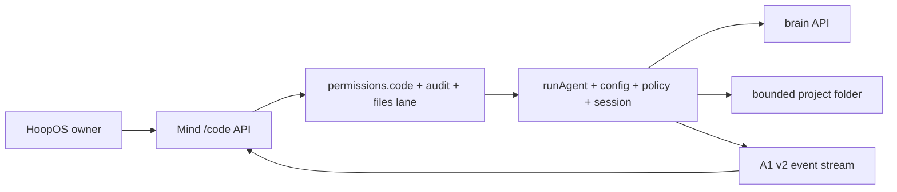

# Developing Hoop Code

这是人类开发者和 coding agent 修改 hcode 的公共入口。先读这一页，再只打开与你的改动直接相关的代码。

> hcode 不是只有一个终端入口。它既是独立 CLI，也是 HoopOS Code 的可嵌入内核。
> 一次改动必须说清楚自己影响哪一个 surface，并证明没有把另一个 surface 留在后面。

## 1. 先认清你在哪里

同一份源码有两个开发位置，不是两个项目：

| 位置 | hcode 根目录 | 用途 |
| --- | --- | --- |
| HoopGram monorepo | `nixos/apps/hcode/` | hcode 与 HoopOS 一起开发、集成和发布的正本 |
| `hoopgram/hcode` GitHub repo | 仓库根目录 | 面向公开开发者的同树投影 |

在 monorepo 里，根目录的 `AGENTS.md`、当前 active task 和 owner 决定高于本页。在公开仓库里，
本页就是第一入口。正式发布前，两个位置的 hcode Git tree 必须完全相同；不要手工维护两份实现，
也不要把 monorepo 私有资料、主机信息或秘密复制进公开仓库。

文档各管一件事：

- `DEVELOPING.md`：如何改、如何验证、何时停下来。
- `ARCHITECTURE.md`：系统结构、事件流、三条渲染路径；这是唯一架构地图。
- `CAPABILITY-BOUNDARY.md`：工具、网络、权限、子代理的信任边界。
- `HCODE.md`：hcode 自动装入 coding agent 上下文的项目硬规则。
- `README.md`：用户看到的产品契约；`CHANGELOG.md`：已经发生的产品变化。

不要在交接文档里复制这些规则。交接只记录当前任务、证据和未完成项，并链接正本。

## 2. 十分钟启动

```sh
# monorepo
cd nixos/apps/hcode

# 公开仓库已经在这个目录，从这里开始
git status --short --branch
node --version                    # source/npm 要求 Node >= 20
npm ci --ignore-scripts           # 只安装锁定的 build/test 依赖；runtime dependencies 仍是 0
npm run check
node ./bin/hcode.js --version
```

然后依次做三件事：

1. 读 `ARCHITECTURE.md` 的 loop、render paths 和 change table。
2. 先打开最近的测试，再打开它保护的实现文件。
3. 写下这次改动的 **surface、问题、不变量、最小验证、停止条件**；没有这五项先不改代码。

给 coding agent 的最短开工指令可以是：

```text
先读 DEVELOPING.md、ARCHITECTURE.md 和最近的测试。
报告本改动影响的 surface、必须保持的不变量和最小测试；只改一个 owner-visible 行为。
先跑定向测试，再做实现，最后按风险关闭验证。不要自行发布、合 main 或触碰秘密。
```

## 3. 一次改动从哪里下手

详细依赖关系只在 `ARCHITECTURE.md` 维护。这里是一张动作索引：

| 想改什么 | 先看 | 通常一起证明 |
| --- | --- | --- |
| 参数、命令、交互生命周期 | `src/cli.js` 与命令自己的小模块 | command test + 受影响的输出路径 |
| 模型流、工具循环、中断 | `src/agent.js`, `src/api.js` | success + error + abort |
| 工具、文件、shell、联网 | `src/tools.js`, `src/policy.js`, `src/gates.js`, `src/sandbox.js` | allow + ask + deny + failure；先读能力边界 |
| 文案、状态、颜色 | `src/ui.js`, `src/presence.js`, `src/commands.js` | composer/readline/plain 的语义一致 |
| 输入框、换行、resize、光标 | `src/composer.js`, `src/frame.js`, `src/input-state.js` | unit/frame + real tmux property gate |
| session、resume、rewind | `src/session.js`, `src/rewind.js` | crash/replay，不重复副作用 |
| native、重启、更新、回滚 | `src/runtime.js`, `src/native-install.js`, `src/update.js` | source/native/Nix 分支 + 真实 artifact probe |
| HoopOS Code | 上述核心文件 + `../mind/code.mjs` / `../mind/runners/hcode.mjs` | hcode tests + HoopOS runner/API contract |

`src/cli.js` 是总机，不是默认落点。它连接的东西最多，所有启动模式都会经过它。能在职责单一的小模块
里完成的行为，不要顺手重构 `cli.js`；确需改它时，先用测试钉住现状，把抽取和产品变化拆开。

## 4. HoopOS 嵌入契约

独立 CLI 从 `bin/hcode.js` 进入 `src/cli.js`。HoopOS 的 Code surface 不以 shell 子进程作为主路径，
而是从 `nixos/apps/mind/code.mjs` 和 `nixos/apps/mind/runners/hcode.mjs` 直接 import hcode 核心：



因此，核心模块必须同时满足这些规则：

1. **可嵌入。** `runAgent()` 接收 config、settings、session、callbacks 和 `AbortSignal`；可复用模块
   不得自行 `process.exit()`、接管 TTY 或假定一定从 `bin/hcode.js` 启动。
2. **位置由宿主注入。** 不把 `cwd`、session 目录或 owner home 写死。独立 CLI 通常写
   `~/.hcode/sessions/`；HoopOS Code 写自己的 `~/mind/hcode-sessions/` 事件流。
3. **两道门都保留。** HoopOS 先执行 `permissions.code` 的 `off → ask → auto` 阶梯、files lane
   限定和审计；hcode 内核仍负责工具 schema、路径、秘密、policy 与 sandbox。任何一边都不能代替另一边。
4. **quiet 仍有语义。** 嵌入模式通过 `onText`、`onTool`、`onEvent` 接收事实，不应收到 CLI 的 ANSI、
   composer frame 或人类提示行。取消必须传到正在运行的工具和 provider。
5. **事件是接口。** 事件名、审批、usage、tool state 或 session replay 有变化时，视为 HoopOS API 变化，
   同时更新并测试 Code adapter；不要在 adapter 里另造一份 hcode 状态机。

改到这些契约时，从 monorepo 根目录补跑：

```sh
node --test nixos/apps/mind/test/runner.mjs nixos/apps/mind/test/code-api.mjs
```

独立仓库里没有 HoopOS 源码时，先关闭 hcode 自身测试，并在 PR/交接中明确写出
`HoopOS integration: not available in this checkout`；集成者在导入 monorepo 后补跑上面的契约测试。

## 5. 不变量

- **一个核心，多种宿主。** CLI、HoopOS、npm、native、Nix 共享同一 agent/tool/policy/session 实现。
- **三条渲染路径，没有第四条。** composer、readline、plain 可以长得不同，必须表达同一事实；plain
  不得出现 ANSI、`
`、光标或颜色才看得懂的含义。
- **事件先于装饰。** session 是 append-only JSONL 事实；UI 只投影，不把终端控制字节写回历史。
- **brain 只提议。** policy/gate 决定，tool 执行；模型不能批准自己的权限。
- **副作用不能假装完成。** 中断/崩溃后的 resume 不重复未知副作用，失败路径要留下可恢复证据。
- **运行时零第三方包。** `package.json` 的 `dependencies` 保持 `{}`。`esbuild`/`postject` 只在构建期使用、
  精确锁定，不进入 hcode runtime。
- **秘密不是测试数据。** 不读取、不复制、不记录 secret-shaped path 的内容；测试只用临时假数据。
- **一个版本。** source/npm/native/Nix 是分发投影，不是功能分支；版本、commit、tree 和 manifest 要能互证。

## 6. 按风险验证，不把每个逗号都跑成发布

先跑最近的测试；只有改动扩大，验证才升级：

| 改动 | 最小关闭方式 |
| --- | --- |
| 文档、文案、单一颜色 | nearest assertion（如有）+ `npm run check` + `git diff --check` |
| 命令、配置、普通逻辑 | nearest `node --test test/<file>.test.js` + `npm run check` |
| UI 语义 | `test/ui.test.js` + 相关 composer/frame test |
| UI 几何、输入协议、resize | 上一行 + `test/render-property.test.js` / PTY gate |
| 权限、工具、网络、session | success + deny/failure/abort 的相关测试 |
| HoopOS 嵌入接口 | hcode 相关测试 + Mind runner/API contract |
| native/安装/更新 | runtime/native targeted tests + 真正目标机 artifact probes |
| 版本候选 | `npm run check` → `npm test` → `npm pack --dry-run --json`，再按发布计划跑平台矩阵 |

常用命令：

```sh
node --test test/ui.test.js
npm run check
npm test
npm pack --dry-run --json
```

几何变化才需要 PTY；普通文字和颜色不需要假装做全平台发布。权限、安全、session 和 release contract
则不能因为改动看起来小就省掉失败路径。

## 7. 分发与发布

一个功能只实现一次：

- **source/npm**：Node >= 20，第三方 runtime packages 为 0。
- **native**：Node 24 LTS + 锁定的 bundler/SEA 构建；macOS arm64/x64、Linux arm64/x64 各自在自己的
  host 构建和执行验证，不能把 cross-build 当作已验证。
- **Nix/HoopOS**：`nixos/apps/hcode.nix` 用 pinned Node 包装同一源码，不通过 npm 安装，也不允许自更新 Nix store。

普通开发可以本地编辑、测试和提交。以下动作是独立的 owner gate，版本号或本地 commit 不会自动授权它们：

- push 到公开或内部 remote；
- merge main 或任何会触发生产的分支；
- 创建 tag、GitHub Release、npm publish；
- Developer ID 签名/公证、Nix/HoopOS 生产切换；
- 花钱、删除、公开暴露或读取秘密。

发布时更新 `package.json`、`package-lock.json`、`src/config.js` 和 `CHANGELOG.md` 的同一版本事实，
并证明公开 repo tree、monorepo subtree、native manifest 与最终 artifact 来自同一 clean commit。

## 8. 完成定义

交付前只问这八项：

- [ ] owner 看得见的问题已经消失，不是只改了内部名字。
- [ ] 改动 surface 已写清；CLI 与 HoopOS 的影响都判断过。
- [ ] 最近的测试先红或明确保护目标，改后为绿。
- [ ] 三条渲染路径、权限门、session 或 runtime 不变量没有被绕过。
- [ ] `CHANGELOG.md` 的 `Unreleased` 记录 owner-visible 变化；纯内部文档整理可写一条合并说明。
- [ ] 架构真的变化时才更新 `ARCHITECTURE.md`，不另建第二张架构地图。
- [ ] `git diff --check` 通过，提交只含本任务文件。
- [ ] 未执行的 HoopOS/平台/发布验证被诚实列出，没有用“应该可以”冒充证据。
